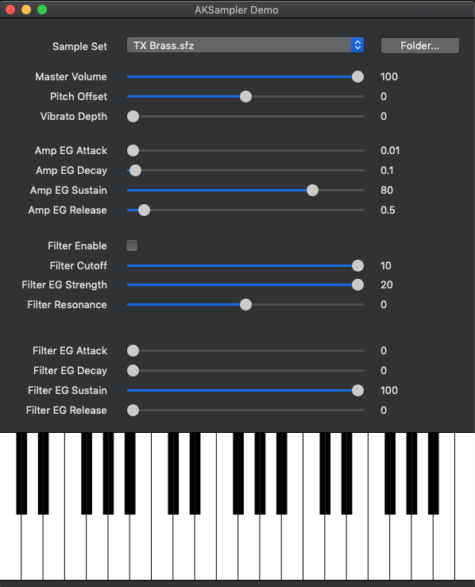

# AudioKit Sampler Demo

This demo allows you to try out the new AKSampler instrument. Unlike the old "AKSampler", which was just a wrapper around the **AUSampler** Audio Unit built into macOS and iOS, the new one is built entirely from scratch.

## Installation with Cocoapods

Inside either the iOS or macOS directory, depending on which version of the app you're installing, run the command line:

    > pod install

Then open the generated workspace file:

    > open SamplerDemo.xcworkspace

## Demo samples

The demo samples are the same as the ones included in the AudioKit **ROMPlayer** code repo on GitHub. They have been compressed using [WavPack](http://www.wavpack.com), and a `.sfz` metadata file has been added, to specify key/velocity mapping and loop points.

## Using your own samples
Preparing samples for any sampler instrument is a somewhat complex process. The basic steps are:

1. **Acquire sample files**, either by recording a hardware or software instrument yourself, or purchasing ready-made samples.
2. If necessary, **edit the samples** to your liking.
3. If applicable, **identify loop-start and end points** for each sample file. With commercial samples, this will usually have been done for you.
4. (Optional) **Create a metadata file** to define the mapping of MIDI note and velocity values to specific samples. Commercial samples typically include such metadata files, often in multiple formats.
5. There is a step 5 on iOS which appears in the README file in the iOS directory.

## Working without a metadata file

Use of a metadata file is optional. Refer to function *loadAndMapCompressedSampleFiles()* in **Conductor.swift** to see how you can load individual sample files programmatically, with the necessary key- and velocity-mapping numbers expressed as parameter values the function calls.

If you want to work with uncompressed samples in standard formats such as `.wav`, `.aif`, `.caf` etc., you can call **AKSampler**'s *loadAKAudioFile()* method, passing in an **AKAudioFile** object initialized with the URL for your file.

## Creating a SFZ metadata file

**AKSampler** presently uses the open-standard [SFZ format](https://en.wikipedia.org/wiki/SFZ_(file_format)) for metadata. The demo samples package includes a README with details about how the samples and `.sfz` metadata file were prepared, and a useful Python3 script to convert ESX24 metadata files (`.esx` files) to SFZ format.

Note that **AKSampler**'s ability to parse `.sfz` files is *very limited*. It won't work on most `.sfz` files.

In a pinch, you can use a text editor to examine the demo `.sfz` files (they're just text) and modify them appropriately for your own samples.

Additional information pertaining to iOS appears in the README file in the iOS directory.
